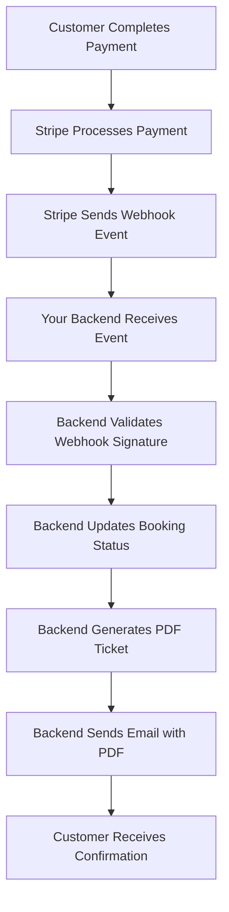

# 🎯 Stripe Webhook Setup Guide

This guide will help you set up the real Stripe webhook for your E-Darshan booking system after deployment.

## 📋 Prerequisites

1. **Stripe Account** - Live account (not test mode)
2. **Deployed Backend** - Your server should be live on Vercel
3. **Stripe Secret Key** - From your Stripe dashboard

## 🚀 Step-by-Step Webhook Setup

### Step 1: Access Stripe Dashboard

1. **Go to [Stripe Dashboard](https://dashboard.stripe.com)**
2. **Make sure you're in "Live mode"** (toggle in top-left)
3. **Navigate to "Developers" → "Webhooks"**

### Step 2: Create New Webhook Endpoint

1. **Click "Add endpoint"**

2. **Fill in the details:**
   - **Endpoint URL**: `https://your-backend-url.vercel.app/api/payments/webhook`
     - Replace `your-backend-url` with your actual Vercel backend URL
     - Example: `https://sihtemple-backend.vercel.app/api/payments/webhook`
   - **Description**: `E-Darshan Booking Confirmation Webhook`

3. **Click "Add endpoint"**

### Step 3: Select Events to Listen For

1. **In the "Events to send" section, click "Select events"**

2. **Search and select these events:**
   - ✅ `checkout.session.completed`
   - ✅ `payment_intent.succeeded`
   - ✅ `payment_intent.payment_failed`
   - ✅ `invoice.payment_succeeded`
   - ✅ `invoice.payment_failed`

3. **Click "Add events"**

4. **Click "Add endpoint"**

### Step 4: Get Webhook Signing Secret

1. **After creating the webhook, click on it**

2. **In the "Signing secret" section, click "Reveal"**

3. **Copy the webhook signing secret** (starts with `whsec_`)

4. **Keep this secret safe - you'll need it for your backend**

### Step 5: Update Backend Environment Variables

1. **Go to your Vercel dashboard**

2. **Select your backend project**

3. **Go to "Settings" → "Environment Variables"**

4. **Add/Update the following variable:**
   ```
   STRIPE_WEBHOOK_SECRET=whsec_your_webhook_secret_here
   ```

5. **Click "Save"**

6. **Redeploy your backend** (Vercel will auto-redeploy)

### Step 6: Test the Webhook

#### Test 1: Create a Test Booking

1. **Go to your frontend URL**
2. **Create a test booking with a real payment**
3. **Complete the payment process**

#### Test 2: Check Webhook Logs

1. **Go back to Stripe Dashboard → Webhooks**
2. **Click on your webhook endpoint**
3. **Check the "Recent deliveries" section**
4. **Look for successful deliveries (green checkmarks)**

#### Test 3: Verify Email Delivery

1. **Check the email address used for booking**
2. **Look for the confirmation email with PDF attachment**
3. **Verify the PDF contains the correct booking details**

## 🔍 Webhook Event Flow

Here's what happens when a payment is completed:



## 🛠️ Webhook Code Explanation

Your webhook handler in `server/routes/paymentRoute.js`:

```javascript
// Stripe Webhook
router.post("/webhook", express.raw({ type: "application/json" }), async (req, res) => {
  const stripe = getStripe();
  const sig = req.headers["stripe-signature"];
  let event;

  try {
    // Verify webhook signature
    event = stripe.webhooks.constructEvent(
      req.body,
      sig,
      process.env.STRIPE_WEBHOOK_SECRET
    );
  } catch (err) {
    console.log("Webhook signature verification failed.", err.message);
    return res.status(400).send(`Webhook Error: ${err.message}`);
  }

  try {
    if (event.type === "checkout.session.completed") {
      const session = event.data.object;
      const ticketId = session.metadata?.ticketId;
      
      if (!ticketId) {
        return res.status(400).send("Missing ticketId in session metadata");
      }
      
      const ticket = await Ticket.findById(ticketId).populate("temple");

      if (ticket) {
        // Update payment status
        ticket.paymentStatus = "paid";
        
        // Generate QR code
        const qrData = JSON.stringify({
          id: ticket._id,
          status: ticket.paymentStatus,
          name: ticket.devoteeName,
          temple: ticket.temple?.name
        });
        ticket.qrCode = await QRCode.toDataURL(qrData);
        
        await ticket.save();

        // Send booking confirmation email
        try {
          await emailService.sendBookingConfirmation(ticket, ticket.temple);
          console.log('Booking confirmation email sent successfully');
        } catch (emailError) {
          console.error('Failed to send booking confirmation email:', emailError);
        }
      }
    }

    return res.status(200).json({ received: true });
  } catch (e) {
    console.error("Error handling webhook:", e);
    return res.status(500).json({ error: "Webhook processing failed" });
  }
});
```

## 🚨 Troubleshooting

### Issue 1: Webhook Not Receiving Events

**Symptoms:**
- No events in Stripe webhook logs
- Bookings not being confirmed

**Solutions:**
1. **Check webhook URL** - Make sure it's correct and accessible
2. **Verify HTTPS** - Webhook URL must use HTTPS
3. **Check server status** - Ensure your backend is running
4. **Test endpoint** - Try accessing the webhook URL directly

### Issue 2: Webhook Signature Verification Failed

**Symptoms:**
- Error: "Webhook signature verification failed"
- 400 status in webhook logs

**Solutions:**
1. **Check webhook secret** - Ensure it's correctly set in environment variables
2. **Verify secret format** - Should start with `whsec_`
3. **Redeploy backend** - After updating environment variables

### Issue 3: Email Not Sending

**Symptoms:**
- Payment successful but no email received
- Webhook processing but email fails

**Solutions:**
1. **Check email configuration** - Verify Gmail App Password
2. **Check server logs** - Look for email error messages
3. **Test email endpoint** - Use the test email API
4. **Check spam folder** - Emails might be filtered

### Issue 4: PDF Generation Fails

**Symptoms:**
- Email sent but no PDF attachment
- Error in server logs about PDF generation

**Solutions:**
1. **Check image files** - Ensure temple background image exists
2. **Verify dependencies** - jsPDF and other libraries installed
3. **Check server logs** - Look for PDF generation errors

## 📊 Monitoring Your Webhook

### Stripe Dashboard Monitoring

1. **Go to Webhooks → Your endpoint**
2. **Check "Recent deliveries" for:**
   - ✅ Successful deliveries (green)
   - ❌ Failed deliveries (red)
   - ⏱️ Response times

3. **Click on individual events to see:**
   - Request payload
   - Response from your server
   - Error messages (if any)

### Vercel Function Logs

1. **Go to Vercel Dashboard → Your backend project**
2. **Click "Functions" tab**
3. **View real-time logs**
4. **Look for webhook processing logs**

## 🔧 Advanced Configuration

### Webhook Retry Policy

Stripe automatically retries failed webhooks:
- **Immediate retry** for 5xx errors
- **Exponential backoff** for other failures
- **Maximum 3 days** of retries

### Webhook Security

Your webhook is secure because:
- **Signature verification** ensures events come from Stripe
- **HTTPS only** prevents man-in-the-middle attacks
- **Environment variables** keep secrets secure

## 🎯 Testing Checklist

Before going live, test:

- [ ] Webhook endpoint is accessible
- [ ] Webhook secret is correctly set
- [ ] Test payment completes successfully
- [ ] Webhook receives the event
- [ ] Booking status updates to "paid"
- [ ] QR code is generated
- [ ] Email is sent with PDF attachment
- [ ] PDF contains correct booking details
- [ ] Email template renders correctly

## 🚀 Going Live

Once testing is complete:

1. **Switch to live Stripe keys** in your frontend
2. **Update environment variables** with live keys
3. **Test with real payment** (small amount)
4. **Monitor webhook logs** for first few transactions
5. **Verify email delivery** for real bookings

## 📞 Support

If you need help:

1. **Check Stripe webhook documentation**
2. **Review Vercel function logs**
3. **Test individual components**
4. **Verify environment variables**

---

**🎉 Your Stripe webhook is now configured and ready to handle real bookings with automatic email confirmations and PDF tickets!**
